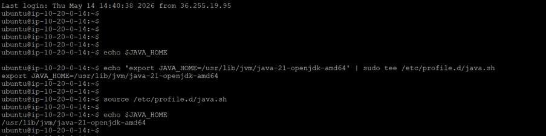

# Logstash Installation Guide

## Overview

This document describes the installation of Logstash on an Ubuntu server to support Oracle audit log collection for Microsoft Sentinel. The guide covers the installation of Java, Logstash, and the initial environment configuration required before configuring Oracle database connectivity.

---

# Architecture Overview

```
Oracle Database
       │
       │ JDBC
       ▼
Logstash
       │
       │ JSON Output
       ▼
Azure Monitor Agent
       │
       ▼
Microsoft Sentinel
```

---

# Prerequisites

Before proceeding with the installation, ensure the following prerequisites are met:

- Ubuntu Server (22.04 LTS or later)
- Sudo privileges
- Internet connectivity to download Elastic packages
- Oracle JDBC Driver (`ojdbc8.jar`) available for later configuration
- Network connectivity to the Oracle database server

---

# Step 1 - Update the Operating System

Update the package repository to ensure the latest package information is available.

```bash
sudo apt update
```

---

# Step 2 - Install Java

Logstash 9.x requires Java 21.

Install OpenJDK 21.

```bash
sudo apt install openjdk-21-jdk -y
```

---

# Step 3 - Verify Java Installation

Verify the installed Java version.

```bash
java -version
```

Expected output:

```text
openjdk version "21"
```

> **Screenshot**
>
> `images/01-java-version.png`

---

# Step 4 - Configure JAVA_HOME

Determine the Java installation path.

```bash
readlink -f $(which java)
```

Example output:

```text
/usr/lib/jvm/java-21-openjdk-amd64/bin/java
```

Create the JAVA_HOME environment variable.

```bash
echo 'export JAVA_HOME=/usr/lib/jvm/java-21-openjdk-amd64' | sudo tee /etc/profile.d/java.sh
```

Load the environment.

```bash
source /etc/profile.d/java.sh
```

Verify JAVA_HOME.

```bash
echo $JAVA_HOME
```

Expected output:

```text
/usr/lib/jvm/java-21-openjdk-amd64
```

> **Screenshot**
>


---

# Step 5 - Install Logstash Repository

Import the Elastic GPG key.

```bash
wget -qO - https://artifacts.elastic.co/GPG-KEY-elasticsearch | sudo gpg --dearmor -o /usr/share/keyrings/elastic-keyring.gpg
```

Install HTTPS transport support.

```bash
sudo apt install apt-transport-https
```

Configure the Elastic package repository.

```bash
echo "deb [signed-by=/usr/share/keyrings/elastic-keyring.gpg] https://artifacts.elastic.co/packages/9.x/apt stable main" | sudo tee /etc/apt/sources.list.d/elastic-9.x.list
```

Update the package repository.

```bash
sudo apt update
```

---

# Step 6 - Install Logstash

Install Logstash.

```bash
sudo apt install logstash
```

---

# Step 7 - Verify Logstash Installation

Verify the installed Logstash version.

```bash
/usr/share/logstash/bin/logstash --version
```

Expected output:

```text
logstash 9.x.x
```

> **Screenshot**
>
> `images/03-logstash-version.png`

---

# Installation Directory

After installation, the following directories are created automatically.

| Directory | Description |
|------------|-------------|
| `/etc/logstash/` | Logstash configuration directory |
| `/etc/logstash/conf.d/` | Pipeline configuration files |
| `/usr/share/logstash/` | Logstash binaries and libraries |
| `/var/lib/logstash/` | Runtime metadata |
| `/var/log/logstash/` | Logstash service logs |

---

# Verify Service Installation

Verify that the Logstash service has been installed successfully.

```bash
systemctl status logstash
```

The service may appear as **inactive (dead)** until a valid pipeline configuration is added.

This is expected behavior immediately after installation.

---

# Next Steps

After completing the Logstash installation, proceed to the next document:

**02-Oracle-JDBC-Configuration.md**

This guide covers:

- Oracle JDBC driver installation
- Logstash Keystore configuration
- Oracle pipeline configuration
- Multiple pipeline configuration
- Output configuration
