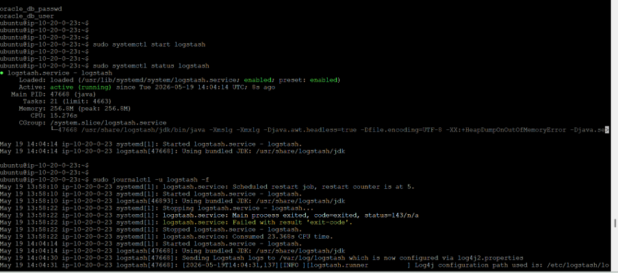
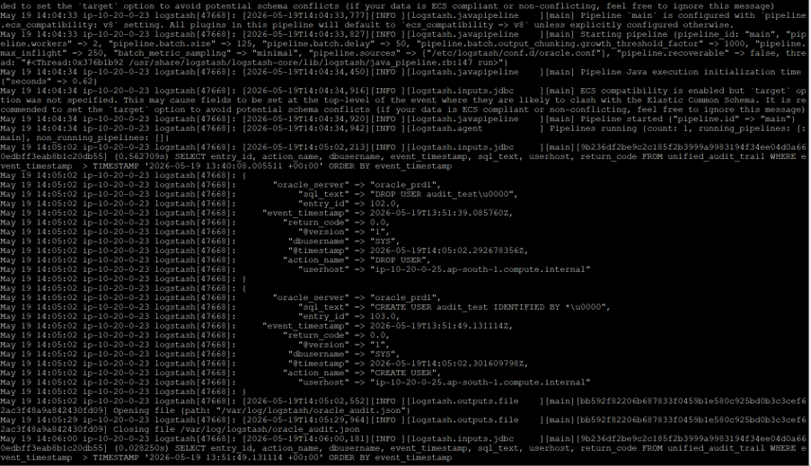
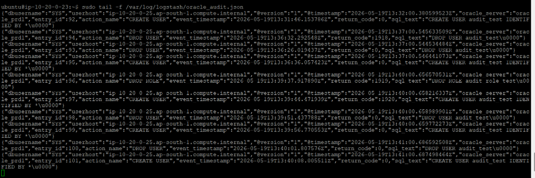
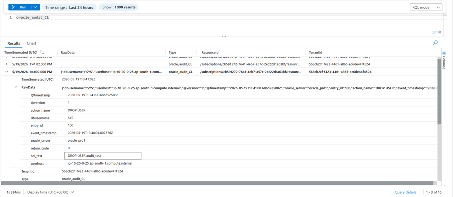

# Validation and Troubleshooting Guide

## Overview

This document describes the validation steps to confirm successful Oracle audit log collection using Logstash. It also includes common troubleshooting scenarios, useful service management commands, and log locations to assist during deployment and operational support.

---

# Validation Workflow

The following validation sequence is recommended after completing the Logstash and Oracle JDBC configuration.

```text
Validate Configuration
        │
        ▼
Start Logstash
        │
        ▼
Monitor Service Logs
        │
        ▼
Verify Oracle Connectivity
        │
        ▼
Verify JSON Output
        │
        ▼
Verify Last Run Metadata
        │
        ▼
Confirm AMA Reads Files
        │
        ▼
Verify Logs in Microsoft Sentinel
```

---

# Step 1 - Validate Pipeline Configuration

Before starting the Logstash service, validate the pipeline syntax.

```bash
sudo -u logstash \
/usr/share/logstash/bin/logstash \
--path.settings /etc/logstash \
--config.test_and_exit \
-f /etc/logstash/conf.d/
```

Expected Output

```text
Configuration OK
```

If any syntax errors are present, Logstash will display the line number and configuration file where the issue occurred.

> **Screenshot**`


---

# Step 2 - Start Logstash

Start the Logstash service.

```bash
sudo systemctl start logstash
```

Verify service status.

```bash
sudo systemctl status logstash
```

Expected Output

```text
Active: active (running)
```

> **Screenshot**
>


---

# Step 3 - Monitor Logstash Logs

Monitor Logstash logs in real time.

```bash
sudo journalctl -u logstash -f
```

Look for messages indicating:

- Pipeline successfully started
- JDBC connection established
- Oracle query executed successfully
- JSON output generated

> **Screenshot**
>


---

# Step 4 - Verify Oracle Connectivity

If Logstash is unable to connect to Oracle, verify listener connectivity.

```bash
nc -zv <oracle_server> 1521
```

Expected Output

```text
Connection succeeded
```

If the connection fails, verify:

- Oracle Listener status
- Firewall rules
- Network routing
- Database hostname or IP address

---

# Step 5 - Verify JSON Output

Confirm that Logstash is generating JSON files.

Example location

```text
/var/log/logstash/oraclelogs/
```

Example

```text
oracle-db01/
└── oracle-db01_YYYY.MM.DD_audit.json
```

Review the generated file.

```bash
cat /var/log/logstash/oraclelogs/oracle-db01/*.json
```

or

```bash
tail -f /var/log/logstash/oraclelogs/oracle-db01/*.json
```

Verify that new audit events continue to appear as Oracle generates additional records.

> **Screenshot**
>


---

# Step 6 - Verify Last Run Metadata

Each pipeline maintains its own tracking file.

Example

```text
/var/lib/logstash/logstash_last_run/
```

Verify the tracking file.

```bash
cat /var/lib/logstash/logstash_last_run/oracle-db01_last_run
```

The timestamp should update after every successful polling cycle.

This confirms that Logstash is tracking the last processed Oracle audit record.

---

# Step 7 - Verify Azure Monitor Agent

If AMA is configured for Custom Log ingestion, verify that it is reading the generated JSON files.

Confirm:

- JSON files are continuously updated
- AMA service is running
- DCR targets the correct directory

Once verified, proceed to Microsoft Sentinel.

---

# Step 8 - Verify Logs in Microsoft Sentinel

Run a validation query.

```kusto
OracleAudit_CL
| sort by TimeGenerated desc
| take 100
```

Confirm:

- Recent audit records are visible
- Timestamp matches Oracle
- No duplicate events
- Expected fields are populated

> **Screenshot**
>


---

# Service Management Commands

Start Logstash

```bash
sudo systemctl start logstash
```

Stop Logstash

```bash
sudo systemctl stop logstash
```

Restart Logstash

```bash
sudo systemctl restart logstash
```

Enable on Startup

```bash
sudo systemctl enable logstash
```

Disable on Startup

```bash
sudo systemctl disable logstash
```

Service Status

```bash
sudo systemctl status logstash
```

---

# Useful Validation Commands

Check Java

```bash
java -version
```

Check Logstash Version

```bash
/usr/share/logstash/bin/logstash --version
```

Check Pipeline Syntax

```bash
sudo -u logstash \
/usr/share/logstash/bin/logstash \
--path.settings /etc/logstash \
--config.test_and_exit \
-f /etc/logstash/conf.d/
```

View Service Logs

```bash
sudo journalctl -u logstash -f
```

Check Oracle Connectivity

```bash
nc -zv <oracle_server> 1521
```

---

# Important Log Locations

| Location | Purpose |
|-----------|---------|
| `/etc/logstash/conf.d/` | Pipeline configuration files |
| `/etc/logstash/pipelines.yml` | Pipeline definitions |
| `/usr/share/logstash/logstash-core/lib/jars/` | JDBC Driver |
| `/var/log/logstash/oraclelogs/` | Generated JSON audit files |
| `/var/lib/logstash/logstash_last_run/` | Incremental tracking metadata |
| `journalctl -u logstash` | Logstash service logs |

---

# Common Issues

| Issue | Possible Cause | Resolution |
|---------|---------------|------------|
| Configuration validation failed | Syntax error | Run `config.test_and_exit` and correct the configuration. |
| Oracle connection refused | Listener unavailable | Verify listener status and TCP port 1521. |
| Authentication failed | Invalid credentials | Validate Logstash Keystore entries. |
| JDBC driver not found | Driver missing | Confirm `ojdbc8.jar` exists in the Logstash library directory. |
| Duplicate records | Incorrect `last_run_metadata_path` | Configure a unique tracking file for each pipeline. |
| No JSON files created | SQL query returned no records | Validate Oracle audit configuration and SQL query. |
| JSON files created but no Sentinel logs | AMA/DCR configuration issue | Verify the Data Collection Rule and monitored directory. |
| Pipeline stopped unexpectedly | Runtime exception | Review `journalctl -u logstash -f` for detailed errors. |

---

# Best Practices

- Validate every configuration change before restarting the service.
- Use a separate pipeline for each Oracle database.
- Maintain independent `last_run_metadata_path` files.
- Store credentials only in the Logstash Keystore.
- Monitor Logstash service logs after every deployment.
- Verify JSON output before investigating Sentinel ingestion issues.
- Perform end-to-end validation from Oracle through to Microsoft Sentinel after any configuration changes.

---

# Conclusion

Following the validation steps in this guide helps ensure reliable Oracle audit log collection, prevents duplicate ingestion, and enables efficient troubleshooting across the complete data ingestion pipeline from Oracle Database to Microsoft Sentinel.
